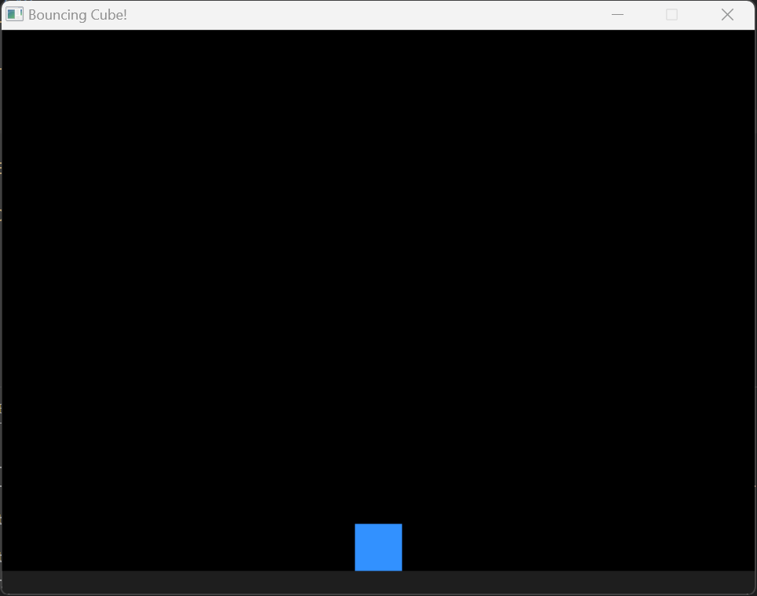

# Bouncing Cube Game




## Overview

Welcome to "Bouncing Cube!" - a simple 2D game built using SDL2. In this game, you control a cube that bounces up when the space key is pressed. The cube is affected by gravity, and the goal is to control its bouncing to prevent it from falling off the screen.

## Features

- Simple and intuitive controls: Press the space key to make the cube bounce.
- Gravity simulation for realistic vertical movement.
- Basic collision detection to keep the cube above the ground.

## Requirements

- SDL2 library: Make sure to have SDL2 installed on your system. You can find installation instructions on the [SDL2 website](https://wiki.libsdl.org/Installation).

## How to Run
in Windows make sure you install the SDL library in a directory in your file system,
and take the path of the library to put it in the makefile 

```

CFLAGS = -Wall -Wextra -I C:\devtools\SDL2\include   # make sure you modify the C:\....
LDFLAGS = -L C:\devtools\SDL2\lib -lmingw32 -lSDL2main -lSDL2 -lSDL2_image -mwindows # and here also C:\..

```

2. Clone this repository:

   ```bash
   git clone <repository_url>
   ```   
3. Run make run to run the Game:
    ```bash
        make run
    ```
